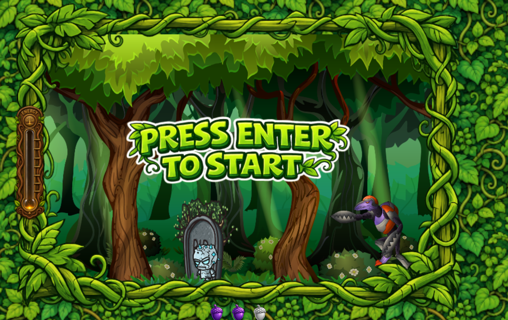

# Angry Forrest

Ein C64-inspiriertes 2D-Jump-'n'-Run im Browser. Das Spiel entsteht im Rahmen meiner Frontend-Ausbildung und verbindet klassische Pixel-Ästhetik mit einer selbst entwickelten JavaScript-Spielarchitektur.



## Aktueller Stand

Angry Forrest ist spielbar und befindet sich in der Polishing- und Erweiterungsphase.

Bereits umgesetzt:

- animierte Titel- und Intro-Szene mit „Press Enter“-Animation
- bildbasierte Glyphen für Titel- und Lauftexte im Retro-Stil
- klarer Spielzustand mit getrenntem Intro und Gameplay
- Canvas-basierte Darstellung mit Kamera- und Parallax-Effekt
- steuerbarer Hauptcharakter mit Idle-, Lauf-, Sprung-, Angriffs-, Treffer- und Todesanimation
- Gegner mit eigener Bewegung, Kollision, Trefferreaktion und Knockout-Animation
- sammelbare Früchte und begrenztes Inventar
- Früchte als Wurfobjekte inklusive Treffererkennung
- Energieanzeige für den Charakter
- Hintergrundmusik, Soundeffekte und Game-Over-Szene
- erster Endgegner mit vorbereiteten Lauf-, Sprung-, Angriffs- und Todesanimationen

Der nächste größere Entwicklungsschritt ist die vollständige Endboss-Choreografie: Aktivierung, Bewegungslogik, Angriffe, Trefferpunkte, Schadensanzeige, Siegbedingung und Abschluss des Spiels werden zu einem konsistenten Bosskampf verbunden.

## Spielidee

Der Spieler steuert eine kleine Waldfigur durch eine lebendige Pixelwelt. Auf dem Weg werden Früchte gesammelt, Gegner überwunden und der Bereich des Endgegners erreicht. Die Spielmechanik ist bewusst überschaubar gehalten, damit Bewegung, Animation, Kollision und Spielgefühl im Mittelpunkt stehen.

## Steuerung

| Taste | Aktion |
| --- | --- |
| `←` / `→` | Bewegen |
| `↑` | Springen |
| `Leertaste` | Frucht werfen |
| `Enter` | Intro überspringen bzw. Spiel starten |

## Technischer Aufbau

Das Projekt läuft ohne Framework und ohne Build-Prozess direkt im Browser. Die Dateien sind nach Verantwortlichkeiten getrennt:

```text
index.html              Einstiegspunkt und Canvas
style.css               Layout und Benutzeroberfläche
js/game.js              Initialisierung des Spiels
js/eventListeners.js    Tastatur-Eingaben
js/models/              Spielobjekte und Zustandslogik
js/levels/              Level-Konfiguration
js/titleGlyphs.js       Zuordnung der Pixel-Glyphen
img/                    Sprites, UI-Elemente und Hintergründe
audio/                  Musik und Soundeffekte
```

Zentrale Architekturentscheidungen:

- `Game` koordiniert Intro, Gameplay und Game-Over.
- `IntroScene` und `World` besitzen jeweils ihren eigenen Animations-Loop.
- `World` verwaltet Level, Kamera, Objekte und Kollisionen.
- Gemeinsame Bewegungs- und Zeichenlogik liegt in den Basisklassen `DrawableObject` und `MovableObject`.
- Gegner und Spielfigur kapseln ihre eigene Animation, Bewegung und Reaktion.

## Lokales Starten

1. Repository klonen oder den Projektordner öffnen.
2. `index.html` über einen lokalen Webserver starten, zum Beispiel mit **Live Server** in Visual Studio Code/Codium.
3. Im Browser die Seite öffnen und im Intro `Enter` drücken.

Ein lokaler Webserver ist erforderlich, damit Assets wie Bilder und Audiodateien zuverlässig geladen werden.

## Entwicklungsfokus

Der Schwerpunkt liegt aktuell auf:

- sauberer Zustands- und Szenenverwaltung
- präziser Kollisionserkennung trotz Kamera-Verschiebung
- synchronisierten Animationen und Soundeffekten
- einem nachvollziehbaren, erweiterbaren Klassenaufbau
- dem vollständigen und fairen Endbosskampf

## Bekannte offene Punkte

- Die Endboss-Logik ist noch nicht vollständig abgeschlossen.
- Die finale Siegsequenz und ein vollständiger Neustart-Flow werden noch ergänzt.
- Einige Debug-Kollisionsrahmen sind während der Entwicklung noch aktiviert.
- Die Darstellung ist derzeit primär auf das Canvas-Format von `720 × 480` ausgelegt.

## Ziel des Projekts

Angry Forrest zeigt, wie aus einzelnen Sprites, Sounds und JavaScript-Klassen ein interaktives Browser-Spiel entsteht. Neben der visuellen Gestaltung stehen dabei objektorientierte Strukturierung, Event-Verarbeitung, Animation, Kollisionserkennung und die schrittweise Entwicklung komplexerer Spiellogik im Vordergrund.
